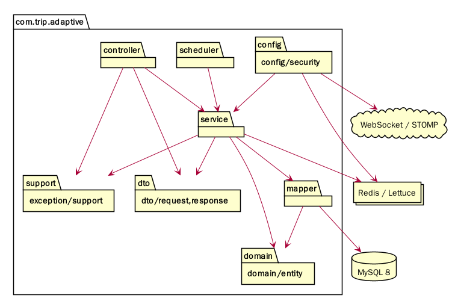
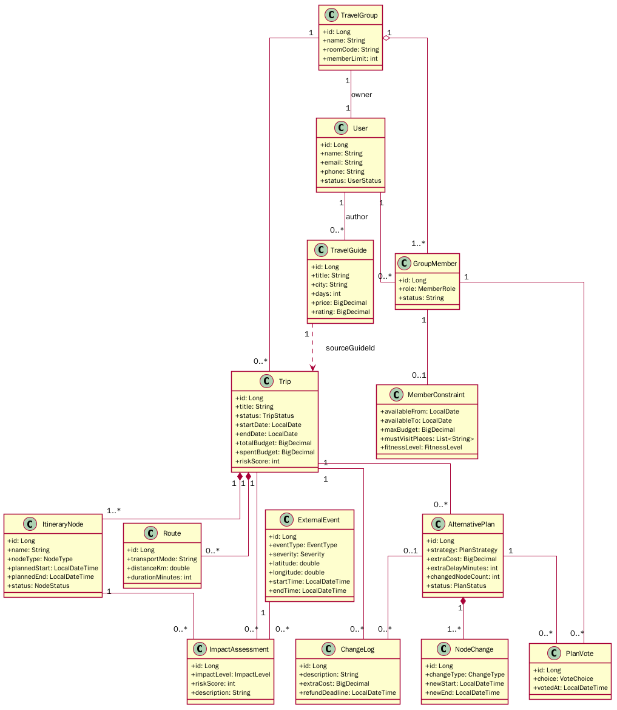
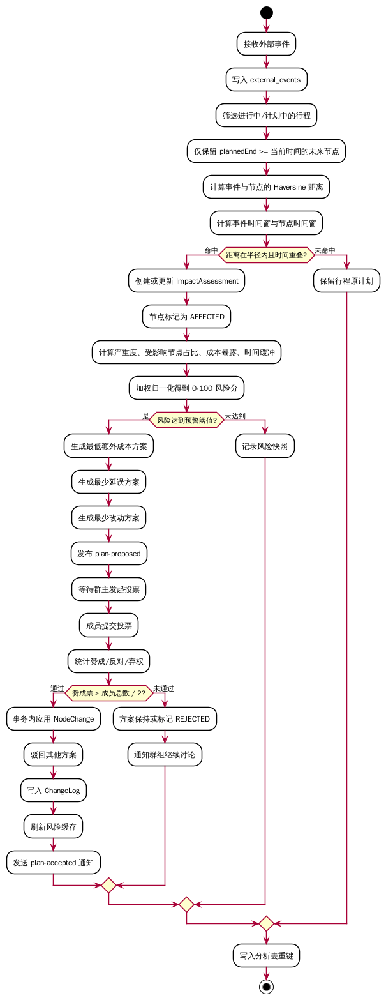
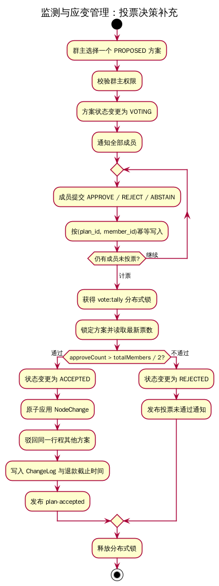
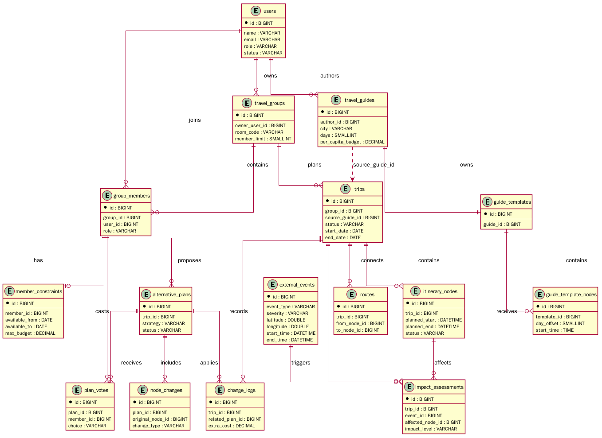

# 系统设计说明书

## 1 文档介绍

### 1.1 目的与范围

本文说明“智能旅游平台”的总体设计、分层架构、模块设计、界面设计、数据库设计和综合技术考虑，为三人团队实现 Spring Boot 3 + MyBatis + MySQL 8 + Redis + React 的目标系统提供统一依据。

本文覆盖：

- 后端 Controller、Service、Mapper、Domain、DTO、Config、Scheduler 和 Security 的设计。
- 前端 React + Vite + TypeScript 页面、组件和真实 API 对接方式。
- 六大业务分组及其功能模块。
- 初始方案、影响匹配、风险评分、自动重规划、投票应用和攻略纳用的核心流程。
- MySQL 表、索引、约束和 Redis 缓存/锁的设计。

仓库中已有的 Spring Boot JPA/H2 代码是可运行基线；本设计说明书描述用户后续实现的 MyBatis/MySQL/Redis 目标版本。

### 1.2 读者对象

本文读者包括：

1. 负责后端实现、数据库和算法的开发人员。
2. 负责 React 页面、交互和接口联调的开发人员。
3. 负责测试、部署、验收和课程设计评审的教师或同学。
4. 后续维护系统、扩展外部事件源或替换地图服务的人员。

### 1.3 参考文档

| 文档 | 用途 |
|---|---|
| [需求设计文档](需求设计文档.md) | 业务背景、20 个基础模块、算法、接口和团队计划 |
| [后端实现全流程](后端实现全流程.md) | 目标后端的分层、20 个模块、算法、Redis 和实时通信 |
| [持久化设计](持久化设计.md) | MySQL 8 DDL、MyBatis XML、TypeHandler 和 Redis Key |
| [模块功能规范清单](模块功能规范清单.md) | 28 个细分功能模块及优先级 |
| [前端说明与前后端对接](前端说明与前后端对接.md) | React 运行方式、类型、API、CORS 和 WebSocket 契约 |
| [系统结构图](系统结构图.png) | 系统六大功能分组与层级结构 |

### 1.4 术语与缩写

| 术语 | 含义 |
|---|---|
| Trip | 一次多人出行行程 |
| Node / ItineraryNode | 行程中的景点、餐饮、住宿、交通等节点 |
| ExternalEvent | 天气、道路、闭馆、大型活动等外部事件 |
| ImpactAssessment | 外部事件与行程节点的影响评估 |
| AlternativePlan | 针对受影响节点生成的替代方案 |
| NodeChange | 替代方案对节点的新增、替换、删除或调整 |
| JWT | JSON Web Token，用于无状态身份声明和会话校验 |
| STOMP | WebSocket 上的消息协议，用于订阅行程事件 |
| MyBatis XML | 以 XML 文件维护 SQL、ResultMap 和动态查询 |
| Haversine | 根据经纬度计算球面距离的算法 |
| P95 | 性能测试中 95% 请求不超过的响应时间 |
| DTO | Data Transfer Object，接口传输对象 |
| DO | Data Object，数据库映射对象 |

## 2 系统概述

“智能旅游平台”是一个面向多人出行的动态规划和中断恢复系统。用户先通过好友和小组功能建立旅伴集合，再填写每位成员的日期、预算、体力、饮食、无障碍和必访地点约束。系统生成初始行程及路线，持续接收外部事件并分析其对未来节点的影响，计算风险并生成三类替代方案。成员通过实时投票达成共识后，系统原子应用变更、记录费用和退款截止时间，并向相关成员发送通知。

主要功能：

1. 账号管理：注册和登录、注销、个人资料管理。
2. 社交组队管理：好友关系管理、出行小组管理、房间码加入。
3. 出行规划管理：成员约束、初始方案、行程节点、地图路线、预算费用。
4. 监测与应变管理：事件接入、影响匹配、风险评分、持续分析、重规划、投票、变更、通知。
5. 社区管理：讨论区、攻略社区、攻略纳用、行后游记生成与发布。
6. 后台与监控管理：用户管理、运营后台、数据统计分析。

## 3 设计约束

### 3.1 需求约束

#### 3.1.1 标准约束

- Java 17 和 Spring Boot 3.3.x。
- MyBatis 使用 `mybatis-spring-boot-starter`，SQL 通过 Mapper XML 管理。
- MySQL 8、InnoDB、utf8mb4，数据库迁移使用 Flyway 或 Liquibase。
- Redis 使用 Spring Data Redis / Lettuce；分布式锁可用 Redisson。
- REST API 前缀为 `/api`，认证头为 `Authorization: Bearer <JWT>`。
- WebSocket/STOMP 连接 `/ws`，行程主题 `/topic/trips/{tripId}`。
- 前端使用 React、Vite、TypeScript、Tailwind CSS。

#### 3.1.2 软硬件环境约束

开发环境至少需要：

```text
JDK 17
Maven 3.9+
Node.js 20+
npm
MySQL 8
Redis 6+
```

课程设计阶段可以在一台开发机上运行前端、后端、MySQL 和 Redis；部署阶段建议使用 Docker Compose 或分别部署应用与数据服务。服务器至少提供 2 vCPU、4 GB 内存和 20 GB 可用空间，具体容量根据日志、图片和用户数量调整。

#### 3.1.3 接口协议约束

- REST 使用 HTTP/JSON，统一响应为 `Result<T>`。
- 成功响应包含 `success`、`code`、`message`、`data` 和可选 `traceId`。
- 业务冲突使用 409，不可行请求使用 422，未认证使用 401，无权限使用 403。
- 时间以 ISO-8601 字符串传输，数据库内部统一 UTC。
- 金额以 `DECIMAL(12,2)` 存储，前端显示人民币时保留两位以内。
- 实时事件类型固定为 `event-ingested`、`impact-assessed`、`plan-proposed`、`vote-updated`、`plan-accepted`。

#### 3.1.4 UI 约束

前端使用青春活力的“登机牌 + 路线轨迹”视觉语言。主色为珊瑚色，安全状态使用薄荷色，风险使用黄色/橙色/红色。页面必须响应式，按钮、弹窗和表单支持键盘焦点，图片加载失败时显示城市渐变占位。真实 API 关闭 Mock 后，页面必须显示加载、错误和空数据状态，不能白屏。

#### 3.1.5 质量约束

- 后端分层边界清晰，数据库写操作具有明确事务边界。
- 核心算法具有可测试的纯函数或独立 Service。
- 前端执行 `npm run lint` 和 `npm run build`。
- 后端执行单元测试、集成测试和 Spotless 格式检查。
- 所有配置和密钥通过环境变量注入，不写入代码仓库。

### 3.2 隐含约束

1. 成员可能同时属于多个小组，但同一小组内只能有一条有效成员关系。
2. 房间码在 MySQL 中唯一，Redis 只是快速解析和限流缓存。
3. 投票必须满足一名成员对同一方案一票；重复提交采用幂等更新。
4. 事件分析只评估未来节点，历史节点不应再次生成替代方案。
5. MySQL 是行程、费用、投票和变更记录的权威来源，Redis 不承载权威写入。
6. 外部事件和地图服务可能不可用，系统必须提供 Mock 或估算降级。
7. 管理员接口不能因为前端隐藏入口而省略后端权限校验。

## 4 开发、测试与运行环境

### 4.1 后端环境

```text
Spring Boot 3.3.x
Java 17
Maven
MyBatis + Mapper XML
MySQL 8
Spring Data Redis + Lettuce
JWT
WebSocket/STOMP
JUnit 5 / MockMvc
```

后端本地配置包括 `spring.datasource.*`、`mybatis.mapper-locations`、`spring.data.redis.*`、JWT 过期时间、CORS Origin、外部事件源和地图服务地址。运行前执行 Flyway/Liquibase 迁移，创建 MySQL 表和索引。

### 4.2 前端环境

```text
React 18
Vite
TypeScript
React Router
TanStack Query
Tailwind CSS 3
lucide-react
```

前端命令：

```bash
cd frontend
npm install
npm run dev -- --host 0.0.0.0 --port 5173
npm run lint
npm run build
```

独立运行时使用 `VITE_USE_MOCKS=true`；联调时设置 `VITE_USE_MOCKS=false` 和 `VITE_API_BASE=http://localhost:8080`。

### 4.3 测试环境

测试分为：

1. Mapper 集成测试：验证 XML SQL、ResultMap、动态筛选和事务查询。
2. Service 单元测试：验证日期交集、预算裁剪、Haversine、风险评分和投票规则。
3. Controller 测试：验证状态码、字段校验、权限和统一响应。
4. Redis 测试：验证会话 TTL、房间码、锁、幂等和缓存失效。
5. 前端测试：验证页面加载、错误、空数据、路由、响应式交互和 API Mock。
6. 端到端测试：走通注册/登录、组队、规划、事件、重规划、投票和攻略套用。

## 5 功能模块设计概要

### 5.1 第0层设计描述

#### 5.1.1 分层架构

后端采用以下调用方向：

```text
Controller
  → Service
    → Mapper Interface
      → Mapper XML
        → MySQL
```

横切能力由 Config、Security、Exception、Support、Scheduler 和 Redis 提供：

- Controller：路由、DTO 参数校验、权限入口和 Result 封装。
- Service：业务编排、事务、算法、资源归属检查和事件发布。
- Mapper：面向领域查询的接口。
- Mapper XML：显式列、ResultMap、动态 SQL、分页和批量查询。
- Domain/DO：数据库映射对象、枚举和领域状态。
- DTO：请求/响应字段，避免直接暴露数据库对象。
- Config/Security：MyBatis、Redis、JWT、CORS、WebSocket 和任务配置。
- Exception：统一业务异常、校验异常和错误码。
- Scheduler：未来节点持续分析、排行榜回写和统计刷新。

后端分层图：



#### 5.1.2 程序目录结构

```text
src/main/java/com/trip/adaptive/
├── controller/
├── service/
├── mapper/
├── domain/
│   ├── entity/
│   └── enums/
├── dto/
│   ├── request/
│   └── response/
├── converter/
├── config/
├── security/
├── exception/
├── scheduler/
└── support/

src/main/resources/
├── mapper/
├── db/migration/
└── application.yml
```

统一返回：

```java
public record Result<T>(
    boolean success,
    String code,
    String message,
    T data,
    String traceId
) {}
```

全局异常处理器将参数校验、资源不存在、权限不足、业务冲突和不可行请求转换为一致的 HTTP 状态与 Result。

#### 5.1.3 领域设计类

核心领域类及关系如下：



User 与 TravelGroup 通过 GroupMember 关联；GroupMember 有 MemberConstraint；TravelGroup 拥有 Trip；Trip 聚合 ItineraryNode 和 Route；ExternalEvent 通过 ImpactAssessment 影响节点；AlternativePlan 由 NodeChange 构成并接收 PlanVote；通过投票后的方案产生 ChangeLog；TravelGuide 通过模板节点生成 Trip。

### 5.2 第1层设计描述

#### 5.2.1 系统结构描述

总体结构图：


六大分组的设计边界：

| 分组 | 主要职责 |
|---|---|
| 账号管理 | User、JWT、资料、合规和权限 |
| 社交组队管理 | Friendship、TravelGroup、GroupMember、房间码 |
| 出行规划管理 | Constraint、Trip、Node、Route、Budget |
| 监测与应变管理 | Event、Impact、Risk、Replan、Vote、Log、Notification |
| 社区管理 | Comment、Guide、GuideTemplate、Apply、Journal |
| 后台与监控管理 | UserAdmin、Operations、Analytics |

#### 5.2.2 业务流程说明

核心动态闭环：



投票决策流程：



业务过程为：

1. 成员约束被聚合，生成初始 Trip。
2. 外部事件入库，按未来节点进行空间和时间匹配。
3. 影响结果驱动风险评分；若风险达到阈值则生成三种 AlternativePlan。
4. 群主发起 VOTING，成员提交唯一投票。
5. 计票时获得 Redis 锁并锁定 MySQL 方案，过半后原子应用 NodeChange。
6. 写 ChangeLog，刷新风险缓存并通过 WebSocket/STOMP 通知成员。
7. `@Scheduled` 只分析未来节点，使用 trip + assessment hash 去重。

### 5.3 模块分解描述

#### 5.3.1 账号管理

**简介：** 管理 User 生命周期、登录会话、个人资料和协议合规。

**功能列表：**

- 注册和登录、注销。
- JWT 签发和 Redis token/session。
- 个人资料和头像管理。
- 登录失败、注销、密码重置审计。

**代表功能设计描述：登录鉴权。**

前端提交邮箱和密码，AuthController 调用 AuthService 查询 UserMapper，使用 BCrypt 校验密码，生成包含 `sub`、`roles`、`jti` 的 JWT，并将 `auth:token:{jti}` 写入 Redis。后续请求由 SecurityFilter 校验 JWT 和 Redis 会话。

**相关类图：** 见[领域设计类图](uml/类图_领域模型.png)中的 User。

| 文件/组件 | 职责 |
|---|---|
| `AuthController.java` | `/api/auth/login`、注册、注销 |
| `UserController.java` | `/api/users/me`、资料修改 |
| `AuthService.java` | 密码校验、JWT、会话 |
| `UserMapper.java/.xml` | users 查询与更新 |
| `JwtAuthenticationFilter.java` | 解析和校验 Bearer Token |
| `SecurityConfig.java` | 放行规则、密码编码器、CORS |

#### 5.3.2 社交组队管理

**简介：** 管理好友关系、小组、成员角色和房间码加入。

**功能列表：**

- 好友搜索、申请、接受、拒绝。
- 创建小组、邀请成员、移除成员、转移群主。
- 生成唯一房间码、Redis 映射和过期。
- GroupMember 与 MemberConstraint 的关联。

**代表功能设计描述：出行小组管理。**

TravelGroupService 在创建时生成房间码、写入 travel_groups，并创建 OWNER 成员记录。加入时从 Redis 查 room code，再在 MySQL 中校验状态和容量。群主操作必须进行资源归属检查。

| 文件/组件 | 职责 |
|---|---|
| `GroupController.java` | groups REST API |
| `FriendshipController.java` | 好友申请 API |
| `GroupService.java` | 房间码、角色和成员状态 |
| `TravelGroupMapper.java/.xml` | 小组、房间码查询 |
| `GroupMemberMapper.java/.xml` | 成员关系和角色 |
| `RoomCodeService.java` | 生成、缓存、限流 |

#### 5.3.3 出行规划管理

**简介：** 将多名成员约束转换为可执行的 Trip、Node 和 Route。

**功能列表：**

- 成员约束(预算/饮食等)管理。
- 初始方案生成。
- 行程节点增删改和排序。
- 地图路线导航与估算降级。
- 预算费用和费用明细。

**代表功能设计描述：初始方案生成。**

PlanningService 在事务内读取所有有效约束，取可用日期交集和最低预算；必访地点去重后生成节点。可选餐饮和住宿按优先级添加，超过预算时先裁剪可选节点，随后调用 RouteService 生成相邻路线。返回 Trip、节点、路线和取舍说明。

| 文件/组件 | 职责 |
|---|---|
| `PlanningController.java` | `/api/groups/{id}/plan` |
| `TripController.java` | Trip、Node、Route REST API |
| `PlanningService.java` | 日期、预算、必访地点和节点生成 |
| `RouteService.java` | Haversine、地图适配和路线缓存 |
| `MemberConstraintMapper.xml` | 批量读取成员约束 |
| `TripMapper.xml` | Trip 事务写入和详情查询 |
| `ItineraryNodeMapper.xml` | 节点批量插入和排序 |
| `RouteMapper.xml` | 相邻路线写入 |

#### 5.3.4 监测与应变管理

**简介：** 处理从事件进入系统到方案采纳和实时通知的核心闭环。

**功能列表：**

- 事件接入管理。
- 影响匹配分析。
- 风险评分预警。
- 持续动态分析。
- 自动重规划。
- 协同投票决策。
- 变更记录管理。
- 消息通知管理。

**代表功能设计描述：影响—风险—重规划—投票。**

ImpactMatchingService 对未来节点执行 Haversine 和时间窗相交；RiskScoringService 使用加权归一化模型生成风险快照；ReplanningService 根据三个策略构造候选 NodeChange；VotingService 将方案从 PROPOSED 推进到 VOTING，统计过半后在事务中应用变更并写日志。Redis 用于风险缓存、重规划去重、投票锁和 WebSocket 多实例广播。

| 文件/组件 | 职责 |
|---|---|
| `EventController.java` | 事件录入和 Mock 事件 |
| `ImpactController.java` | assess 和影响查询 |
| `ReplanController.java` | 三类替代方案 |
| `VoteController.java` | 发起、投票、计票 |
| `EventIngestionService.java` | 事件校验、保存和发布 |
| `ImpactMatchingService.java` | 空间/时间匹配 |
| `RiskScoringService.java` | 0—100 风险与因素 |
| `ReplanningService.java` | 候选方案和最小扰动 |
| `VotingService.java` | 状态机、锁、幂等和原子应用 |
| `NotificationService.java` | 站内通知、STOMP 发布 |
| `AdaptiveAnalysisScheduler.java` | 定时未来节点分析 |

#### 5.3.5 社区管理

**简介：** 支持团队讨论、攻略复用和行程结束后的内容沉淀。

**功能列表：**

- 讨论区管理。
- 攻略社区管理。
- 攻略纳用。
- 行后游记生成与发布。
- @提及、点赞、收藏、评分和内容安全。

**代表功能设计描述：攻略纳用。**

GuideApplyService 读取 GuideTemplate 和 GuideTemplateNode，将 `dayOffset/startTime/endTime` 映射为目标出发日期的绝对时间，校验成员约束并返回 warnings。确认后在一个事务中创建 Trip、Nodes 和 Routes，写入 `source_guide_id`。操作由 Redis 幂等键保护。

| 文件/组件 | 职责 |
|---|---|
| `GuideController.java` | 攻略搜索、详情、收藏、评分、套用 |
| `CommentController.java` | 行程/方案评论和点赞 |
| `JournalController.java` | 行后游记生成和发布 |
| `GuideService.java` | 筛选、热度、收藏和评分 |
| `GuideApplyService.java` | 模板实例化和约束校验 |
| `ContentSafetyService.java` | 文件、类型、大小和敏感内容检查 |
| `TravelGuideMapper.xml` | 多条件筛选和分页 |
| `GuideTemplateNodeMapper.xml` | 相对时间模板读取 |

#### 5.3.6 后台与监控管理

**简介：** 为管理员提供用户、运营、统计和运行状态能力。

**功能列表：**

- 用户查询、禁用和恢复。
- 攻略、事件源和公告运营。
- 行程数量、预算、事件命中率、方案采纳率统计。
- Actuator 健康检查、结构化日志、指标和配置。

**代表功能设计描述：统计分析。**

AdminStatsService 使用带索引的聚合 SQL 查询 MySQL，按日期和目的地生成统计序列，短时间缓存到 Redis。管理员接口必须经过角色校验，并对查询范围和分页参数做限制。

| 文件/组件 | 职责 |
|---|---|
| `AdminController.java` | `/api/admin/**` |
| `AdminUserService.java` | 用户管理和审核 |
| `AdminStatsService.java` | 聚合查询和看板数据 |
| `AdminMapper.xml` | 统计 SQL |
| `ActuatorConfig.java` | health、metrics、info |
| `application.yml` | 日志、配置和任务开关 |

## 6 用户界面设计概述

前端已实现 React + Vite + TypeScript 应用，默认使用 Mock 数据，真实模式通过 `VITE_USE_MOCKS=false` 访问后端。整体视觉采用登机牌卡片和路线轨迹，公共组件包括 Card、Button、Badge、BoardingPassCard、RouteTrail、RiskGauge、Modal、Toast、LoadingState、ErrorState 和 EmptyState。

| 模块 | 页面/路由 | 界面功能 | 主要数据 | 主要按钮 |
|---|---|---|---|---|
| 账号管理 | `/login`、`/register`、`/settings` | 登录、注册、资料编辑、注销 | User、token | 登录、注册、保存、退出 |
| 社交组队管理 | `/friends`、`/groups`、`/groups/:id` | 好友申请、小组卡片、房间码、成员角色 | Friendship、TravelGroup、GroupMember | 添加好友、创建小组、加入、移除 |
| 成员约束 | `/groups/:id/constraints/:memberId` | 日期、预算、必访地点、饮食、无障碍 | MemberConstraint | 保存约束、添加地点 |
| 出行规划 | `/trips`、`/trips/new`、`/trips/:id` | 登机牌行程卡、初始方案、路线轨迹 | Trip、ItineraryNode、Route | 新建、生成、查看、分享 |
| 地图预算 | `/routes`、`/budget`、`/settlement` | 路线、距离、费用、AA 结算 | Route、Bill、BillShare | 重新规划、记录费用、录入消费 |
| 监测应变 | `/events`、`/impacts`、`/plans`、`/votes` | 事件源、风险仪表、方案比较、投票进度 | ExternalEvent、ImpactAssessment、AlternativePlan、PlanVote | 录入事件、分析、刷新、发起投票、计票 |
| 变更通知 | `/trips/:id/changelog`、`/notifications` | 成本、退款截止时间、未读通知 | ChangeLog、Notification | 标记已读、查看方案 |
| 社区管理 | `/guides`、`/guides/:id`、`/discussions` | 攻略筛选、模板路线、讨论和攻略纳用 | TravelGuide、TemplateNode、Comment | 搜索、收藏、攻略纳用、发布 |
| 后台监控 | `/admin` | 统计卡片、目的地和预算分布 | AdminStats | 刷新、管理事件源 |

页面的 API 请求使用 `Result<T>`，API 不可用时显示“连不上后端服务”、配置的 API Base 和切换 Mock 的提示；图片失败显示城市渐变占位，不渲染空白区域。

## 7 数据库设计概述

### 7.1 概念模型 E-R 图

核心实体关系如下：



关系说明：

- users 通过 group_members 加入 travel_groups。
- group_members 拥有 member_constraints。
- travel_groups 拥有 trips，trips 聚合 itinerary_nodes 和 routes。
- external_events 与 itinerary_nodes 通过 impact_assessments 关联到 trips。
- trips 生成 alternative_plans，方案由 node_changes 组成并接收 plan_votes。
- 通过方案后产生 change_logs。
- users 发布 travel_guides，攻略包含 guide_templates 和 guide_template_nodes。
- trips.source_guide_id 指向套用来源攻略。

### 7.2 数据库表设计

数据库使用 MySQL 8、InnoDB、utf8mb4。所有主要表包含 `created_at` 和 `updated_at`，适合的业务表包含 `deleted_at` 逻辑删除。金额使用 `DECIMAL(12,2)`，时间使用 `DATETIME(3)`，坐标使用 `DOUBLE`。

#### 7.2.1 账号、社交和约束表

| 表 | 关键字段 | 约束/索引 | 用途 |
|---|---|---|---|
| `users` | id、name、email、phone、password_hash、avatar、role、status | email 唯一；name、status 索引 | 用户和角色 |
| `friendships` | requester_id、addressee_id、pair_key、status | pair_key 唯一；双方状态索引 | 好友申请和关系 |
| `travel_groups` | owner_user_id、room_code、room_code_expire_at、member_limit | room_code 唯一；owner 索引 | 出行小组 |
| `group_members` | group_id、user_id、role、status | `(group_id,user_id)` 唯一 | 小组成员 |
| `member_constraints` | member_id、available_from、available_to、max_budget、JSON 需求 | member_id 唯一 | 成员约束 |

#### 7.2.2 行程、路线和事件表

| 表 | 关键字段 | 约束/索引 | 用途 |
|---|---|---|---|
| `trips` | group_id、title、status、start_date、end_date、total_budget、source_guide_id、version | group/status/date；时间状态 | 行程主表 |
| `itinerary_nodes` | trip_id、place_name、latitude、longitude、node_type、planned_start/end、sequence_order、status | trip/时间、trip/status、地理索引 | 行程节点 |
| `routes` | trip_id、from_node_id、to_node_id、transport_mode、distance_km、duration_minutes | trip 和节点组合唯一 | 节点间路线 |
| `external_events` | event_type、severity、latitude、longitude、radius_km、start_time、end_time、payload | 活跃时间、类型严重度、地理时间复合索引 | 外部事件 |
| `impact_assessments` | trip_id、event_id、affected_node_id、risk_score、impact_level、assessment_hash | `(trip,event,node)` 唯一；行程级别索引 | 影响结果 |

#### 7.2.3 应变、投票和费用表

| 表 | 关键字段 | 约束/索引 | 用途 |
|---|---|---|---|
| `alternative_plans` | trip_id、strategy、extra_cost、extra_delay_minutes、changed_node_count、status | trip/status/created；策略和 hash | 替代方案 |
| `node_changes` | plan_id、original_node_id、change_type、新时间/地点/费用 | plan 索引 | 节点变更 |
| `plan_votes` | plan_id、member_id、choice、voted_at | `(plan_id,member_id)` 唯一 | 投票 |
| `change_logs` | trip_id、description、extra_cost、refund_deadline、related_plan_id | trip/created | 变更历史 |
| `bills` | trip_id、title、amount、paid_by_member_id、split_mode | trip/created | 共同消费 |
| `bill_shares` | bill_id、member_id、share_amount、share_ratio | `(bill_id,member_id)` 唯一 | 费用拆分 |
| `comments` | author_id、target_type、target_id、parent_id、content、mentions、like_count | target/type/id/created | 讨论评论 |
| `notifications` | user_id、type、title、detail、payload、read_at | user/read/created | 站内通知 |

#### 7.2.4 攻略和内容表

| 表 | 关键字段 | 约束/索引 | 用途 |
|---|---|---|---|
| `travel_guides` | title、cover、author_id、city、tags、theme、days、per_capita_budget、rating、favorite_count、status | city/theme/days/budget/rating/status 复合索引、FULLTEXT | 攻略主表 |
| `guide_templates` | guide_id、title、total_days | guide_id 唯一 | 攻略模板 |
| `guide_template_nodes` | template_id、name、place_name、node_type、day_offset、start_time、end_time、cost、sequence_order | template/day/order 唯一 | 相对时间节点 |
| `guide_favorites` | guide_id、user_id | `(guide_id,user_id)` 唯一 | 收藏关系 |
| `guide_ratings` | guide_id、user_id、rating、comment | `(guide_id,user_id)` 唯一 | 攻略评分 |

MyBatis 查询设计：

- `TripMapper.xml` 使用批量查询加载 Trip、nodes 和 routes，避免详情页 N+1。
- `TravelGuideMapper.xml` 使用 `<where>`、`<if>`、`<choose>` 实现城市、主题、天数、价格、评分、关键字和排序筛选。
- 枚举使用 TypeHandler，JSON 数组使用 Jackson TypeHandler。
- 投票计票和方案应用在 Service 使用 `@Transactional`，并配合 `SELECT FOR UPDATE`。
- Redis 使用 cache-aside 策略，写入 MySQL 成功后显式删除风险、事件、预算等缓存。

## 8 综合考虑

### 8.1 稳定性和可扩展性

系统将权威数据放在 MySQL，将 Redis 用作会话、热点、锁、幂等和广播，不把重要业务状态只放在缓存中。事件接入和持续分析采用幂等键，投票应用采用分布式锁与数据库事务，服务重启后可以从 MySQL 恢复。Controller、Service 和 Mapper 接口隔离后，可在未来将事件接入、攻略搜索或统计拆分成独立服务。

### 8.2 性能分析

常规列表接口通过分页和索引保证性能，攻略搜索使用复合索引和 FULLTEXT，事件查询使用时间/地理字段索引。行程详情采用批量查询，避免每个节点单独查询路线。风险快照和活跃事件使用 Redis 短缓存，热门攻略使用 ZSET。核心算法只针对未来节点执行，定时任务按行程分批并设置并发上限。

性能目标为：普通接口 P95 小于 500 ms，风险查询 P95 小于 800 ms，投票写入 P95 小于 500 ms，初始规划和重规划 P95 小于 3 s。达到规模后可增加读副本、分区事件表、异步统计和独立算法服务。

### 8.3 复用和移植

后端可复用统一 Result、异常、JWT、RedisKey、锁、分页和事件发布组件；前端可复用 Query hooks、ErrorState、LoadingState、RouteTrail、RiskGauge 和 BoardingPassCard。外部地图、天气和交通通过接口适配器隔离，系统可以从 Mock 迁移到真实供应商。Docker Compose 和环境变量配置支持从开发机移植到测试或生产环境。

### 8.4 防错与出错处理

输入层使用 Bean Validation 检查日期、金额、枚举和字符串长度；Service 层检查权限、状态机、日期交集、成员容量和预算约束；数据库层使用唯一索引、外键和非空约束；Redis 层使用 TTL、锁超时和幂等键。

典型错误处理：

| 错误 | 处理 |
|---|---|
| 日期无交集 | 返回 409 `DATE_CONFLICT`，提示调整成员可用日期 |
| 预算无法满足 | 返回 422 `INFEASIBLE_PLAN`，列出不可裁剪节点 |
| 房间码过期 | 返回 409，提示重新生成房间码 |
| 事件无坐标 | 保存事件但跳过空间匹配，并提示数据不完整 |
| 重复投票 | 按唯一键幂等更新，不产生重复票 |
| 重复计票 | Redis 锁 + requestId 幂等键，已应用方案直接返回结果 |
| 外部服务超时 | 使用估算路线或缓存结果，记录告警 |
| 前端 API 不可用 | 显示加载错误状态，提示检查后端或切换 Mock |
| 数据库事务失败 | 回滚节点、方案、日志和 Trip 更新，保留错误 traceId |
