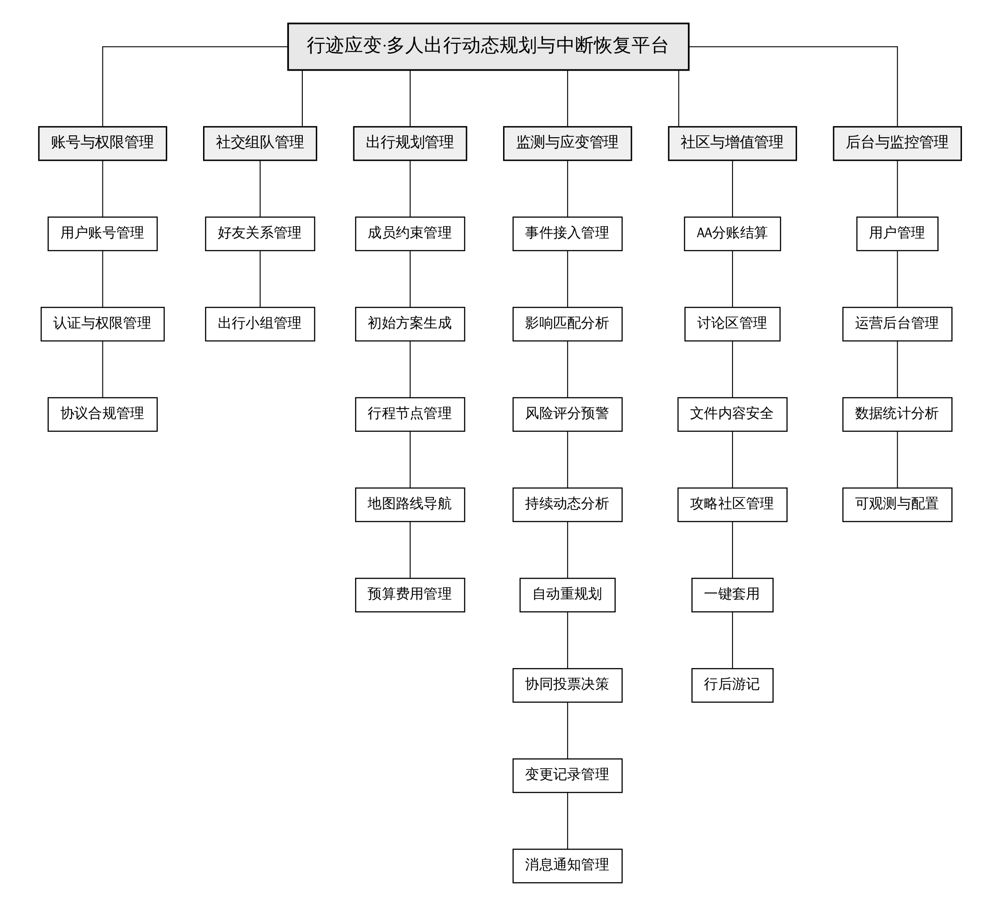

# 软件需求规格说明书

## 1 引言

### 1.1 课题的来源、意义和目标

本课题来源于多人旅行中“计划容易制定、变化难以协同处理”的实际问题。天气、道路管制、景点闭馆、交通延误等外部事件会使原行程失效，而传统旅行工具通常只能展示静态攻略或地图，不能同时考虑多名成员的可用日期、预算、饮食、无障碍和必访地点等约束，也不能把影响分析、替代方案、集体投票和变更记录串成闭环。

“智能旅游平台”面向多人出行场景，目标是提供从组队、约束收集、初始规划到实时监测、风险评估、自动重规划和集体确认的完整支持。平台的核心价值是把外部变化转换成可解释、可比较、可共同决策的行动建议，降低临时决策成本，减少成员之间的信息不对称，并保留完整的变更与费用记录。

系统目标如下：

1. 支持注册和登录、注销、个人资料管理。
2. 支持好友关系、出行小组和房间码加入。
3. 根据成员预算、饮食、可用日期、体力和必访地点生成可行的初始方案。
4. 接入天气、交通和城市活动等外部事件，使用空间距离和时间窗匹配受影响行程节点。
5. 采用可解释的加权风险评分，输出 0—100 的风险值和风险因素。
6. 自动生成最低额外成本、最少延误、最少改动三类替代方案。
7. 支持多人投票、过半判定、原子应用方案、通知和变更日志。
8. 支持攻略浏览、筛选、攻略纳用、行后游记生成与发布。
9. 提供用户管理、运营后台和数据统计能力。

## 2 系统功能性需求（可行性与方案比选）

### 2.1 可行性分析

#### 2.2.1 经济可行性分析

本系统采用开源技术栈，核心组件包括 Java 17、Spring Boot 3、MyBatis、MySQL 8、Redis、React、Vite 和 Tailwind CSS，不需要购买商业中间件授权。开发阶段可使用单机 MySQL、Redis 和本地文件存储，部署成本低。系统的主要成本来自开发人员时间、测试环境、地图或外部事件服务的调用费用以及正式部署后的服务器资源。

三人团队按照账号与基础能力、出行规划与核心算法、监测应变与前端联调进行分工，可以复用 Spring Boot、React 和 MyBatis 的成熟生态，减少重复开发。对于地图服务、天气服务等可能产生费用的外部资源，系统提供估算路线和 Mock 事件作为降级方案，因此课程设计阶段不依赖付费服务即可完成主要功能验证。

从收益角度看，平台可以减少多人旅行中反复沟通、人工重排日程和分账核算的时间成本。对于课程设计项目而言，系统规模与三人团队的实现能力匹配，投入产出合理，具有经济可行性。

#### 2.2.2 技术可行性分析

后端采用 Spring Boot 3 提供 REST API、参数校验、统一异常处理、JWT 安全和 WebSocket/STOMP 实时通信；MyBatis 通过 Mapper XML 控制复杂查询，MySQL 8 存储权威业务数据，Redis 提供会话、缓存、幂等、锁和多实例广播能力。前端采用 React + Vite + TypeScript + Tailwind，能够实现响应式页面和类型安全的 API 客户端。

系统中的关键算法均可在 Java 中实现：

- 成员日期交集使用最大开始日期和最小结束日期。
- 影响匹配使用 Haversine 地理距离和时间区间重叠。
- 风险评分使用严重度、节点占比、成本暴露和时间缓冲的归一化加权。
- 重规划将候选替代节点按成本、延误或变更数排序。
- 投票通过 MySQL 事务、行锁和 Redis 分布式锁保证一致性。
- 攻略套用把相对日期和时间转换为真实 `LocalDateTime`。

Java 17、MyBatis XML、MySQL 8 和 Redis 均有稳定的开发工具和测试工具，技术可行性高。

#### 2.2.3 法律可行性分析

系统不以收集敏感身份信息为目标，只保存完成账号、组队、规划和通知所必需的数据。密码只保存 BCrypt 摘要，不保存明文密码；JWT 密钥和数据库凭据通过环境变量或密钥管理系统提供。系统对用户头像、攻略图片和外部事件内容保留来源字段，并在文件与内容安全模块中提供类型、大小和内容检查。

系统中的天气、交通和攻略数据必须遵守第三方服务的 API 使用条款和版权要求。攻略发布者应对其文字、图片和路线内容负责；平台应提供举报、下架和管理员审核入口。评论、@提及和行后游记应提供删除或逻辑删除能力，避免侵犯个人隐私和名誉权。

#### 2.2.4 环境影响因素分析

系统为信息服务软件，不直接产生工业污染。服务器运行会消耗电力，使用缓存、分页查询、定时任务限流和资源按需扩展可以降低资源消耗。地图路线估算、行程规划和事件匹配能够减少重复查询外部服务，降低网络请求量。

系统的业务目标也具有积极环境意义：通过路线合并、公共交通选择、减少无效折返和合理安排节点，帮助用户形成更节约时间与交通资源的出行方案。系统不应把“低成本”作为唯一目标，应同时考虑成员安全、体力和无障碍需求。

### 2.2 方案比选

| 比选维度 | 方案 A：Spring Boot + MyBatis + MySQL + Redis + React | 方案 B：单体脚本 + SQLite + 服务端渲染 | 方案 C：微服务 + 多数据库 + 消息队列 |
|---|---|---|---|
| 开发难度 | 适中，适合三人团队 | 初期较低，但实时协同和权限扩展困难 | 高，超出课程设计规模 |
| 数据一致性 | MySQL 事务、唯一约束和行锁较成熟 | 事务和并发能力有限 | 能力强，但运维复杂 |
| 实时通信 | WebSocket/STOMP 与 Redis Pub/Sub 可实现 | 需要额外搭建 | 能力强，但组件过多 |
| 前端体验 | React 组件化、响应式和类型安全 | 页面复用性较弱 | 前端仍需独立建设 |
| 算法扩展 | Service 层便于集中实现 | 业务与页面容易耦合 | 可拆分但早期成本高 |
| 部署成本 | 单体部署即可 | 低 | 高 |
| 结论 | **选用** | 不选 | 不选 |

选用方案 A 的原因是：它在开发效率、工程规范、事务能力、实时通信和扩展性之间取得平衡，能够完整覆盖本课题的核心闭环，同时保留后续拆分服务的可能性。

## 3 系统功能性需求

### 3.1 系统结构

系统总体结构图如下：



系统按照用户可理解的业务边界划分为六大分组：

1. **账号管理**：负责注册和登录、注销、个人资料管理，并提供 JWT 鉴权和角色权限能力。
2. **社交组队管理**：负责好友关系、出行小组和房间码加入，为后续成员约束与共同决策提供参与者集合。
3. **出行规划管理**：负责成员约束、初始方案、行程节点、地图路线和预算费用，是生成可执行行程的基础。
4. **监测与应变管理**：负责外部事件接入、影响匹配、风险评分、持续动态分析、自动重规划、投票、变更记录和消息通知，是系统核心难点闭环。
5. **社区管理**：负责讨论、攻略浏览、攻略纳用和行后游记，形成从内容消费到旅行反馈的闭环。
6. **后台与监控管理**：负责用户管理、运营后台和数据统计。

动态业务闭环为：

```text
成员约束 → 初始方案 → 外部事件 → 影响匹配
→ 风险评分 → 替代方案 → 协同投票
→ 原子应用 → 变更记录与通知 → 持续动态分析
```

### 3.2 功能模块

#### 3.2.1 账号管理

**功能简表：**

| 功能 | 说明 |
|---|---|
| 注册 | 使用邮箱、手机号或账号密码创建用户 |
| 登录 | 校验密码并签发 JWT，Redis 保存会话 |
| 注销 | 删除 Redis 会话并使 JWT 失效 |
| 个人资料管理 | 修改昵称、邮箱、手机号和头像 |

用例图：[角色用例图](uml/用例图_角色.png)。时序图：[登录鉴权时序图](uml/时序图_登录鉴权.png)；活动图：[登录活动图](uml/活动图_登录.png)。以下表格均采用学校标准九字段用例描述格式。

| 用例名称 | 注册 |
|---|---|
| 用例标识号 | UC101 |
| 简要说明 | 游客创建平台账号，系统保存 BCrypt 密码摘要并建立可登录用户。 |
| 前置条件 | 游客未登录；邮箱或手机号未被占用。 |
| 参与者 | 游客、账号服务、MySQL |
| 基本事件流 | 1、游客填写账号、密码并同意协议；2、前端校验并提交注册 DTO；3、服务校验唯一性和密码强度；4、使用 BCrypt 生成密码摘要；5、在 users 表创建用户和默认角色；6、返回用户资料；7、用例结束 |
| 其他事件流 | 1、游客可取消注册；2、注册成功后可进入登录页。 |
| 异常事件流 | 1、账号已存在返回 409；2、字段格式错误返回 400；3、协议未同意返回 422；4、数据库写入失败回滚并返回 500；5、重复提交由唯一索引拦截。 |
| 后置条件 | users 新增可用用户记录，数据库不保存明文密码。 |

| 用例名称 | 用户登录 |
|---|---|
| 用例标识号 | UC102 |
| 简要说明 | 用户校验凭据获得 JWT，并在 Redis 建立可撤销会话。 |
| 前置条件 | 用户已注册且未禁用；前端处于登录页。 |
| 参与者 | 游客、账号服务、Redis 会话缓存 |
| 基本事件流 | 1、用户输入账号和密码；2、服务查询 users 并校验 BCrypt；3、检查账号状态和角色；4、签发含 sub、jti 和过期时间的 JWT；5、保存 auth:token:{jti}；6、返回令牌和资料；7、前端进入首页；8、用例结束 |
| 其他事件流 | 1、旧会话达到上限时可先注销最早会话。 |
| 异常事件流 | 1、用户不存在或密码错误返回 401；2、账号禁用返回 403；3、Redis 不可用拒绝建立会话并告警；4、字段不完整返回 400；5、失败次数超限返回 429。 |
| 后置条件 | 用户获得有效 JWT，Redis 保存对应会话。 |

| 用例名称 | 注销 |
|---|---|
| 用例标识号 | UC103 |
| 简要说明 | 用户注销当前会话，使 JWT 即时失效。 |
| 前置条件 | 请求携带有效 JWT，Redis 存在对应 jti。 |
| 参与者 | 用户、账号服务、Redis 会话缓存 |
| 基本事件流 | 1、用户点击注销；2、前端携带 JWT 调用接口；3、服务解析并校验 jti；4、删除 auth:token:{jti}；5、返回成功；6、前端清理令牌并回登录页；7、用例结束 |
| 其他事件流 | 1、用户可注销全部其他会话；2、重复注销按幂等成功处理。 |
| 异常事件流 | 1、令牌缺失返回 401；2、Redis 删除超时返回可重试错误并记录日志；3、非法 jti 不得删除其他会话。 |
| 后置条件 | 当前 JWT 会话被删除，受保护接口不再接受该令牌。 |

| 用例名称 | 个人资料管理 |
|---|---|
| 用例标识号 | UC104 |
| 简要说明 | 用户查看并修改昵称、联系方式、城市和头像。 |
| 前置条件 | 用户已通过 JWT 鉴权；头像符合大小和 MIME 限制。 |
| 参与者 | 用户、用户服务、文件服务 |
| 基本事件流 | 1、打开资料页；2、读取 users；3、修改昵称、邮箱、手机号、城市或头像；4、校验格式和唯一性；5、上传合规头像；6、更新 users 和 updated_at；7、返回最新资料；8、用例结束 |
| 其他事件流 | 1、只修改文字资料时不上传头像；2、取消编辑不产生写操作。 |
| 异常事件流 | 1、修改他人资料返回 403；2、联系方式冲突返回 409；3、头像不合规返回 422；4、文件服务失败保留原头像并返回 503；5、并发版本冲突要求刷新。 |
| 后置条件 | 用户资料和头像地址被持久化。 |

#### 3.2.2 社交组队管理

**功能简表：**

| 功能 | 说明 |
|---|---|
| 好友关系管理 | 搜索用户、发送申请、接受或拒绝申请 |
| 出行小组管理 | 创建小组、邀请成员、移除成员、转移群主 |
| 房间码加入 | 使用唯一房间码加入或申请加入小组 |

功能分组用例图：[社交组队管理用例图](uml/用例图_社交组队管理.png)。时序图：[房间码加入时序图](uml/时序图_房间码加入.png)；活动图：[房间码加入活动图](uml/活动图_房间码加入.png)。

| 用例名称 | 好友关系管理 |
|---|---|
| 用例标识号 | UC201 |
| 简要说明 | 用户搜索其他用户、发送好友申请并维护好友关系。 |
| 前置条件 | 用户已登录；目标用户存在且不是本人。 |
| 参与者 | 用户、好友服务、通知服务 |
| 基本事件流 | 1、用户搜索昵称、邮箱或手机号；2、系统返回脱敏结果；3、用户发送申请；4、服务校验双方关系和重复申请；5、写入 friendships；6、创建通知；7、目标用户接受后更新状态；8、用例结束 |
| 其他事件流 | 1、目标用户可拒绝申请；2、申请人可撤回待处理申请；3、用户可删除好友。 |
| 异常事件流 | 1、参数非法返回 400；2、目标用户不存在返回 404；3、重复申请返回 409；4、读取私密资料返回 403；5、通知失败进入重试队列。 |
| 后置条件 | 好友关系状态和通知记录已持久化。 |

| 用例名称 | 出行小组管理 |
|---|---|
| 用例标识号 | UC202 |
| 简要说明 | 群主创建和维护小组、成员列表及群主角色。 |
| 前置条件 | 用户已登录；执行移除或转让时用户是群主。 |
| 参与者 | 群主、成员、小组服务、通知服务 |
| 基本事件流 | 1、群主填写小组名称；2、创建 travel_groups 并生成唯一 room_code；3、邀请好友或查看成员；4、写入 group_members；5、移除成员或转让群主；6、事务校验角色并更新；7、发送通知；8、用例结束 |
| 其他事件流 | 1、成员可主动退出；2、转让后新群主获得管理权限；3、群主可解散空小组。 |
| 异常事件流 | 1、非群主操作返回 403；2、名称不合规返回 400；3、转让目标不是成员返回 409；4、并发操作由行锁保证；5、通知失败记录待发送通知。 |
| 后置条件 | 小组、成员角色和群主关系与 MySQL 一致。 |

| 用例名称 | 房间码加入 |
|---|---|
| 用例标识号 | UC203 |
| 简要说明 | 成员使用唯一房间码加入小组并获得默认成员约束。 |
| 前置条件 | 小组存在且房间码未过期；成员未加入；接口通过 JWT 鉴权。 |
| 参与者 | 成员、群主、小组服务、Redis、通知服务 |
| 基本事件流 | 1、成员输入房间码；2、解析 Redis 的 room:{roomCode}；3、回 MySQL 校验状态、容量和重复成员；4、事务写入 group_members；5、创建默认 member_constraints；6、刷新成员数缓存；7、通知群主和成员；8、用例结束 |
| 其他事件流 | 1、Redis 未命中时回源 travel_groups 并重建映射；2、群主可使用邀请链接。 |
| 异常事件流 | 1、房间码错误返回 404/409；2、人数已满返回 409；3、重复加入返回 409；4、频率过高返回 429；5、并发加入由锁和唯一约束回滚超额请求。 |
| 后置条件 | 成员加入小组并拥有默认约束，群主收到通知。 |

#### 3.2.3 出行规划管理

**功能简表：**

| 功能 | 说明 |
|---|---|
| 成员约束管理 | 维护日期、预算、必访地点、体力、饮食和无障碍需求 |
| 初始方案生成 | 聚合约束，计算日期交集和最低预算并生成节点 |
| 行程节点管理 | 创建、编辑、删除、排序和确认节点 |
| 地图路线导航 | 计算节点间距离、时长、交通方式和费用 |
| 预算费用管理 | 汇总总预算、已用预算、剩余预算和费用明细 |

功能分组用例图：[出行规划管理用例图](uml/用例图_出行规划管理.png)。时序图：[初始方案时序图](uml/时序图_初始方案.png)；活动图：[初始方案活动图](uml/活动图_初始方案.png)。

| 用例名称 | 成员约束管理 |
|---|---|
| 用例标识号 | UC301 |
| 简要说明 | 小组成员维护日期、预算、必访地点、体力、饮食和无障碍约束。 |
| 前置条件 | 用户属于目标小组；成员记录存在。 |
| 参与者 | 成员、群主、约束服务 |
| 基本事件流 | 1、打开约束页面；2、读取 member_constraints；3、填写日期、预算、地点和需求；4、校验日期顺序、预算和长度；5、保存约束与 updated_at；6、返回摘要；7、用例结束 |
| 其他事件流 | 1、群主可在授权范围内协助维护；2、可删除必访地点；3、可选字段使用默认值。 |
| 异常事件流 | 1、非成员返回 403；2、日期无效或预算为负返回 400；3、并发修改返回 409；4、数据库不可用返回 503。 |
| 后置条件 | 最新约束已持久化，可供规划服务读取。 |

| 用例名称 | 初始方案生成 |
|---|---|
| 用例标识号 | UC302 |
| 简要说明 | 聚合全体约束，生成含节点、路线、预算和取舍说明的初始行程。 |
| 前置条件 | 小组存在且用户有权限；至少一名成员有有效约束。 |
| 参与者 | 群主、成员、规划服务、地图服务、Redis |
| 基本事件流 | 1、群主选择小组和日期；2、读取所有约束；3、计算日期交集；4、计算最低预算；5、合并去重必访地点；6、生成景点、餐饮和住宿节点；7、超预算裁剪可选节点；8、生成相邻路线；9、事务保存 trips、itinerary_nodes、routes；10、返回方案和取舍；11、用例结束 |
| 其他事件流 | 1、地图服务不可用时使用缓存或估算；2、用户可取消预览；3、已有草稿可覆盖或另存。 |
| 异常事件流 | 1、日期无交集返回 409；2、预算不足返回 422；3、无可行节点返回业务错误；4、Redis 锁失败拒绝重复任务；5、路线超时保存无路线草稿；6、事务失败回滚。 |
| 后置条件 | 生成可编辑 Trip、节点和路线，取舍可追溯。 |

| 用例名称 | 行程节点管理 |
|---|---|
| 用例标识号 | UC303 |
| 简要说明 | 用户对景点、餐饮、住宿和交通节点进行增删改、排序和确认。 |
| 前置条件 | 行程存在；用户是成员或群主；节点未被变更锁定。 |
| 参与者 | 成员、群主、行程服务 |
| 基本事件流 | 1、打开行程详情；2、读取 Trip 和节点；3、新增、编辑、删除或拖动节点；4、校验时间和类型；5、更新节点顺序和状态；6、标记路线待重算；7、广播更新；8、用例结束 |
| 其他事件流 | 1、群主可确认节点；2、受影响节点可替换或取消；3、删除前可取消。 |
| 异常事件流 | 1、非成员返回 403；2、时间冲突返回 422；3、节点被方案锁定返回 409；4、并发排序用版本号；5、广播失败不回滚 MySQL。 |
| 后置条件 | 节点内容、顺序和状态已持久化。 |

| 用例名称 | 地图路线导航 |
|---|---|
| 用例标识号 | UC304 |
| 简要说明 | 按相邻节点和交通方式计算距离、时长、费用并展示路线。 |
| 前置条件 | 至少两个带坐标节点；用户有查看权限。 |
| 参与者 | 成员、路线服务、地图 API 或估算组件 |
| 基本事件流 | 1、选择行程和交通方式；2、读取节点坐标；3、调用地图适配器；4、保存 routes；5、返回距离、时长和费用；6、前端展示路线；7、用例结束 |
| 其他事件流 | 1、可切换步行、驾车和公共交通；2、可重算单段；3、地图失败时使用 Haversine 估算。 |
| 异常事件流 | 1、坐标缺失返回 422；2、地图超时返回可重试结果；3、调用限额时读缓存或降级；4、非成员返回 403。 |
| 后置条件 | 路线结果按需写入 routes，不改变节点权威数据。 |

| 用例名称 | 预算费用管理 |
|---|---|
| 用例标识号 | UC305 |
| 简要说明 | 记录费用并计算总预算、已用金额、剩余金额及超支提示。 |
| 前置条件 | 行程存在；用户是成员或群主；金额和币种格式正确。 |
| 参与者 | 成员、群主、预算服务 |
| 基本事件流 | 1、打开预算页；2、汇总预算和明细；3、新增或修改类别、金额、节点和付款人；4、校验非负 DECIMAL；5、保存并重算汇总；6、返回卡片；7、超支时生成提示；8、用例结束 |
| 其他事件流 | 1、可删除未结算费用；2、群主可调整预算；3、费用可关联节点或作为通用费用。 |
| 异常事件流 | 1、非成员写入返回 403；2、精度或币种非法返回 400；3、已结算费用修改返回 409；4、并发汇总使用事务和行锁；5、数据库失败不更新缓存。 |
| 后置条件 | 费用明细和汇总一致，必要时产生超支通知。 |
**核心算法：**

```text
from = max(所有成员 availableFrom)
to = min(所有成员 availableTo)
budget = min(所有成员 maxBudget)
places = stableDistinct(所有 mustVisitPlaces)
nodes = 必访地点 + 可选餐饮/住宿
若总成本 > budget，则按可选优先级裁剪
routes = 计算相邻节点路线
```


#### 3.2.4 监测与应变管理

**功能简表：**

| 功能 | 说明 |
|---|---|
| 事件接入管理 | 接收天气、交通、闭馆和大型活动事件 |
| 影响匹配分析 | 按地理半径和时间窗匹配未来行程节点 |
| 风险评分预警 | 输出 0—100 分风险和因素拆解 |
| 持续动态分析 | 定时只分析未来节点并根据剩余时间更新风险 |
| 自动重规划 | 生成最低额外成本、最少延误、最少改动三种方案 |
| 协同投票决策 | 成员投票、过半判定、原子应用方案 |
| 变更记录管理 | 保存变更原因、额外成本和退款截止时间 |
| 消息通知管理 | 发送事件、影响、方案、投票和采纳通知 |

功能分组用例图：[监测与应变管理用例图](uml/用例图_监测与应变管理.png)。完整时序图：[核心闭环时序图](uml/时序图_核心闭环.png)；活动图：[核心动态闭环活动图](uml/活动图_核心动态闭环.png)。

| 用例名称 | 事件接入管理 |
|---|---|
| 用例标识号 | UC401 |
| 简要说明 | 接收外部事件并保存为可分析的标准化事件。 |
| 前置条件 | 事件源已鉴权或管理员已登录；事件有类型、严重度和有效时间。 |
| 参与者 | 外部事件源、管理员、事件服务、MySQL、Redis |
| 基本事件流 | 1、事件源提交 JSON；2、校验签名、字段和时间；3、标准化类型、坐标和严重度；4、写入 external_events；5、刷新活跃事件缓存；6、触发影响分析；7、返回事件 ID；8、用例结束 |
| 其他事件流 | 1、管理员可手动录入；2、重复事件按来源 ID 或内容哈希幂等更新；3、Mock Provider 可生成模拟事件。 |
| 异常事件流 | 1、签名无效返回 401/403；2、字段缺失返回 400；3、重复事件不重复创建；4、第三方超时保留旧缓存并告警；5、写入失败不触发分析。 |
| 后置条件 | 标准化事件已保存，可被活跃查询和影响匹配读取。 |

| 用例名称 | 影响匹配分析 |
|---|---|
| 用例标识号 | UC402 |
| 简要说明 | 使用 Haversine 距离和时间窗重叠判断事件影响的未来节点。 |
| 前置条件 | 行程有未来节点；事件有时间窗和坐标或区域；用户有行程权限。 |
| 参与者 | 成员、事件服务、影响分析服务 |
| 基本事件流 | 1、读取未来节点和活跃事件；2、计算 Haversine 距离；3、判断距离小于事件半径；4、判断时间窗重叠；5、生成影响等级；6、写入 impact_assessments；7、标记命中节点；8、返回影响列表；9、用例结束 |
| 其他事件流 | 1、无坐标时按行政区域或地点匹配；2、用户可手动重评估；3、无命中时只保存分析结果。 |
| 异常事件流 | 1、时间逆序或半径负数返回 422；2、节点无坐标则跳过并记录；3、事件服务不可用时使用缓存；4、事件和行程重复评估按分析哈希去重。 |
| 后置条件 | 影响评估和受影响节点被持久化。 |

| 用例名称 | 风险评分预警 |
|---|---|
| 用例标识号 | UC403 |
| 简要说明 | 对影响结果进行归一化加权，输出 0—100 风险分、等级和因素。 |
| 前置条件 | 已有影响评估；严重度、节点占比、成本暴露和时间缓冲可计算。 |
| 参与者 | 成员、风险服务、通知服务 |
| 基本事件流 | 1、读取最新评估；2、计算严重度归一值；3、计算节点比例和成本暴露；4、计算剩余缓冲因子；5、按权重求分；6、截断为 0—100 并分级；7、保存风险快照；8、超过阈值发送预警；9、用例结束 |
| 其他事件流 | 1、无命中节点返回 0 分；2、用户可查看因素拆解；3、管理员可配置阈值。 |
| 异常事件流 | 1、因子缺失使用默认值并标记；2、计算溢出时截断并告警；3、通知失败不回滚快照；4、并发评估按版本保留最新。 |
| 后置条件 | 行程拥有最新风险快照，高风险进入通知队列。 |

| 用例名称 | 持续动态分析 |
|---|---|
| 用例标识号 | UC404 |
| 简要说明 | 由 @Scheduled 定时重评估未开始节点，并随剩余时间变化更新风险。 |
| 前置条件 | 定时任务启用；存在进行中行程和未来节点；服务可访问 MySQL 与 Redis。 |
| 参与者 | 定时任务、影响服务、风险服务、重规划服务 |
| 基本事件流 | 1、调度器扫描进行中行程；2、过滤已开始节点；3、读取活跃事件和分析哈希；4、仅对新增事件或时间变化超阈值的行程重算；5、执行影响匹配和风险评分；6、高风险时生成或更新方案；7、写入去重键和快照；8、发布通知；9、用例结束 |
| 其他事件流 | 1、无未来节点则跳过；2、哈希相同则跳过；3、多实例由 Redis 锁保证单实例执行。 |
| 异常事件流 | 1、获取锁失败跳过本轮；2、单个行程超时不影响其他行程；3、依赖不可用等待下次；4、幂等键拒绝重复方案。 |
| 后置条件 | 未来节点风险保持最新，已开始节点不被重规划。 |

| 用例名称 | 自动重规划 |
|---|---|
| 用例标识号 | UC405 |
| 简要说明 | 生成最低成本、最少延误和最少改动三类替代方案。 |
| 前置条件 | 有确认的影响评估；至少一个未来节点可调整；用户有权限。 |
| 参与者 | 群主、重规划服务、路线服务、风险服务 |
| 基本事件流 | 1、读取受影响节点、约束和路线；2、生成替代候选；3、按成本生成方案一；4、按延误生成方案二；5、按变更数生成方案三；6、写入 alternative_plans 和 node_changes；7、计算风险、成本和说明；8、返回三套方案；9、用例结束 |
| 其他事件流 | 1、候选不足时只返回可行方案；2、路线服务失败时标记待计算；3、群主可重生成或取消草稿。 |
| 异常事件流 | 1、无可替代节点返回 422；2、违反硬约束的方案过滤；3、Redis 锁和幂等键防重复；4、部分保存失败回滚；5、路线超时返回降级路线。 |
| 后置条件 | 行程拥有可比较的方案草稿，当前行程不被改变。 |

| 用例名称 | 协同投票决策 |
|---|---|
| 用例标识号 | UC406 |
| 简要说明 | 群主发起投票，成员投票后按过半规则原子应用方案。 |
| 前置条件 | 方案属于目标行程；投票未结束；发起人是群主。 |
| 参与者 | 群主、成员、投票服务、Redis、MySQL、通知服务 |
| 基本事件流 | 1、群主选择方案发起投票；2、状态 PROPOSED→VOTING；3、成员提交赞成、反对或弃权；4、按 (plan_id, member_id) 保存或幂等更新；5、到期或群主计票；6、锁定投票并统计；7、赞成票超过成员总数一半时开启事务；8、应用 node_changes 并写 change_logs；9、设为 APPLIED、驳回兄弟方案并广播；10、用例结束 |
| 其他事件流 | 1、成员可截止前修改投票；2、未过半则拒绝或继续等待；3、重复计票返回已有结果。 |
| 异常事件流 | 1、非成员或非群主返回 403；2、投票结束返回 409；3、并发计票由分布式锁保护；4、应用失败回滚节点、日志和状态；5、广播失败保留数据库结果。 |
| 后置条件 | 投票、方案、节点变更、日志和通知保持一致，重复请求不重复应用。 |

| 用例名称 | 变更记录管理 |
|---|---|
| 用例标识号 | UC407 |
| 简要说明 | 查询事件导致的变更、成本、退款截止时间和关联方案。 |
| 前置条件 | 行程存在；查询者是成员或管理员。 |
| 参与者 | 成员、群主、变更记录服务 |
| 基本事件流 | 1、打开变更记录；2、按行程分页读取 change_logs；3、返回原因、时间、操作者、节点变化和费用；4、查看关联方案和退款截止时间；5、用例结束 |
| 其他事件流 | 1、可按事件或方案筛选；2、群主可补充说明；3、管理员可导出记录。 |
| 异常事件流 | 1、非成员返回 403；2、行程不存在返回 404；3、分页非法返回 400；4、导出超时返回任务 ID；5、历史记录修改返回 409。 |
| 后置条件 | 用户获得不可覆盖的完整变更历史。 |

| 用例名称 | 消息通知管理 |
|---|---|
| 用例标识号 | UC408 |
| 简要说明 | 为事件、风险、投票、方案和攻略纳用生成并管理通知。 |
| 前置条件 | 接收者账号有效；业务事件已提交；WebSocket 通道可选。 |
| 参与者 | 用户、通知服务、WebSocket/STOMP、Redis Pub/Sub |
| 基本事件流 | 1、业务服务提交通知载荷；2、写入 notifications；3、Redis Pub/Sub 广播到各实例；4、在线用户通过 /topic 收到消息；5、用户打开通知中心；6、读取未读列表；7、标记单条或全部已读；8、用例结束 |
| 其他事件流 | 1、离线用户只保存站内通知；2、可按类型筛选；3、广播失败由下次查询补偿。 |
| 异常事件流 | 1、接收者不存在记录并丢弃；2、WebSocket 断开不回滚写入；3、业务幂等键去重；4、批量读取超时分页返回；5、未授权读取他人通知返回 403。 |
| 后置条件 | 通知持久化，在线用户可实时收到，已读状态可追踪。 |
**风险评分需求：**

```text
riskScore = clamp(
  0.40 * severityScore
  + 0.25 * affectedNodeRatio
  + 0.15 * costExposure
  + 0.20 * (1 - timeBufferRatio)
) * 100
```


#### 3.2.5 社区管理

**功能简表：**

| 功能 | 说明 |
|---|---|
| 讨论区管理 | 发布行程/方案评论、@成员、点赞和回复 |
| 攻略社区管理 | 按城市、主题、天数、价格和评分搜索攻略 |
| 攻略纳用 | 选择小组和出发日期，将模板相对时间映射到真实时间 |
| 行后游记生成与发布 | 根据行程节点、变更和评论生成可编辑游记并发布 |

功能分组用例图：[社区管理用例图](uml/用例图_社区管理.png)。时序图：[攻略纳用时序图](uml/时序图_攻略纳用.png)；活动图：[攻略纳用活动图](uml/活动图_攻略纳用.png)。

| 用例名称 | 讨论区管理 |
|---|---|
| 用例标识号 | UC501 |
| 简要说明 | 用户围绕行程或攻略发布讨论、回复、@成员和点赞。 |
| 前置条件 | 用户已登录；关联行程或攻略存在且可访问。 |
| 参与者 | 成员、评论服务、通知服务 |
| 基本事件流 | 1、打开讨论区；2、分页读取 comments；3、输入评论或回复并@成员；4、检查长度和敏感词；5、保存评论及父子关系；6、更新互动计数；7、向被@用户发送通知；8、用例结束 |
| 其他事件流 | 1、用户可删除自己的评论；2、可取消点赞；3、管理员可隐藏违规评论。 |
| 异常事件流 | 1、未登录发布返回 401；2、资源不存在返回 404；3、敏感或超长文本返回 422；4、重复点赞按唯一约束幂等；5、非作者删除返回 403。 |
| 后置条件 | 合法评论和互动状态已持久化。 |

| 用例名称 | 攻略社区管理 |
|---|---|
| 用例标识号 | UC502 |
| 简要说明 | 用户发布、编辑、筛选、收藏、评分和浏览攻略。 |
| 前置条件 | 已发布攻略可匿名浏览；发布、编辑和评分需要登录。 |
| 参与者 | 用户、攻略服务、审核服务、Redis |
| 基本事件流 | 1、输入城市、主题、天数、预算或评分条件；2、MyBatis 动态 SQL 过滤 travel_guides；3、按最新、最热或评分排序分页；4、打开详情并增加浏览量；5、登录用户收藏或评分；6、作者创建或编辑并提交审核；7、用例结束 |
| 其他事件流 | 1、无条件时返回热门列表；2、热门排序读取 Redis ZSET；3、作者可下架；4、管理员可审核或精选。 |
| 异常事件流 | 1、筛选参数非法返回 400；2、攻略不存在返回 404；3、未登录互动返回 401；4、重复收藏或评分更新记录；5、Redis 计数失败时异步回写；6、审核不可用保留草稿。 |
| 后置条件 | 搜索、互动记录和攻略状态一致，热门计数最终回写。 |

| 用例名称 | 攻略纳用 |
|---|---|
| 用例标识号 | UC503 |
| 简要说明 | 将攻略模板相对日期和时间映射为目标小组的绝对行程并校验约束。 |
| 前置条件 | 攻略已发布；成员已加入小组；模板含 dayOffset、startTime、endTime。 |
| 参与者 | 成员、攻略服务、行程服务、约束服务 |
| 基本事件流 | 1、查看攻略详情；2、选择小组和出发日期；3、读取模板节点；4、计算 plannedStart = startDate + dayOffset + startTime；5、校验日期、预算和必访地点；6、展示警告和裁剪建议；7、成员确认；8、事务创建 Trip、ItineraryNode、Route 并写 sourceGuideId；9、跳转新行程；10、用例结束 |
| 其他事件流 | 1、可修改出发日期；2、超出软约束时可保留提醒；3、重复确认用幂等键返回已创建行程。 |
| 异常事件流 | 1、攻略未发布返回 404/409；2、小组无权访问返回 403；3、模板时间非法返回 422；4、硬约束无法满足则阻止创建；5、事务或路线失败回滚；6、并发套用由 Redis 锁限制。 |
| 后置条件 | 新行程保存攻略来源和绝对节点时间，用户可继续编辑。 |

| 用例名称 | 行后游记生成与发布 |
|---|---|
| 用例标识号 | UC504 |
| 简要说明 | 根据已完成行程、节点、变更和讨论生成可编辑游记并发布。 |
| 前置条件 | 行程已结束或完成；用户是行程成员或作者。 |
| 参与者 | 成员、游记服务、攻略审核服务 |
| 基本事件流 | 1、选择已完成行程；2、读取节点、路线、变更和评论；3、生成标题、时间线和地点草稿；4、编辑文字、图片和隐私范围；5、执行内容检查；6、保存草稿或发布；7、发布后关联攻略模板；8、用例结束 |
| 其他事件流 | 1、可保存草稿；2、可只对小组成员可见；3、管理员审核后进入公开攻略。 |
| 异常事件流 | 1、未完成行程返回 409；2、非成员返回 403；3、图片不合规拒绝上传；4、敏感内容进入待审核；5、发布冲突保留草稿并提示重试。 |
| 后置条件 | 游记草稿或已发布内容被保存，可进入攻略社区检索。 |

#### 3.2.6 后台与监控管理

**功能简表：**

| 功能 | 说明 |
|---|---|
| 用户管理 | 查询用户、禁用账号、恢复账号和查看操作记录 |
| 运营后台管理 | 管理攻略、事件源、公告和基础配置 |
| 数据统计分析 | 统计行程数、预算分布、事件命中率和方案采纳率 |

功能分组用例图：[后台与监控管理用例图](uml/用例图_后台与监控管理.png)。时序图：[后台统计时序图](uml/时序图_后台统计.png)；活动图：[后台统计活动图](uml/活动图_后台统计.png)。

| 用例名称 | 用户管理 |
|---|---|
| 用例标识号 | UC601 |
| 简要说明 | 管理员查询用户、查看状态并执行封禁、解封等账号管理操作。 |
| 前置条件 | 管理员已登录并具有用户管理权限。 |
| 参与者 | 管理员、用户管理服务 |
| 基本事件流 | 1、打开用户管理；2、校验 ADMIN 角色；3、按状态和关键词分页查询 users；4、查看详情和操作记录；5、提交封禁或解封；6、写入状态和审计信息；7、通知受影响用户；8、用例结束 |
| 其他事件流 | 1、可按注册时间筛选；2、可强制下线使 Redis 会话失效；3、可撤销未执行操作。 |
| 异常事件流 | 1、非管理员返回 403；2、用户不存在返回 404；3、不能封禁最高权限账号；4、并发修改返回 409；5、Redis 下线失败保留封禁结果并告警。 |
| 后置条件 | 用户状态和管理记录已更新，相关会话按策略失效。 |

| 用例名称 | 运营后台管理 |
|---|---|
| 用例标识号 | UC602 |
| 简要说明 | 管理员审核攻略和评论，维护事件来源、公告及运营内容。 |
| 前置条件 | 管理员已登录并具有运营后台权限；运营对象存在。 |
| 参与者 | 管理员、运营服务、审核服务 |
| 基本事件流 | 1、进入运营后台；2、加载待审核内容和事件源；3、查看详情；4、执行通过、精选、下架或驳回；5、维护事件源和公告；6、保存操作记录；7、刷新前台缓存；8、用例结束 |
| 其他事件流 | 1、可批量审核；2、可退回补充后重提；3、公告可设置上下线时间。 |
| 异常事件流 | 1、权限不足返回 403；2、内容已被处理返回 409；3、事件源配置不完整拒绝启用；4、缓存刷新失败异步重试；5、非法状态转换返回 422。 |
| 后置条件 | 审核状态、事件源和公告状态已持久化，前台读取最新结果。 |

| 用例名称 | 数据统计分析 |
|---|---|
| 用例标识号 | UC603 |
| 简要说明 | 管理员按时间范围查看行程、预算、事件命中率和方案采纳率等指标。 |
| 前置条件 | 管理员已登录并有后台权限；时间范围和粒度合法。 |
| 参与者 | 管理员、统计服务、MySQL、Redis |
| 基本事件流 | 1、打开后台统计；2、校验 ADMIN 角色；3、校验时间范围和粒度；4、读取 Redis 快照或查询 MySQL 聚合；5、计算行程、预算、命中率和采纳率；6、返回卡片、趋势和排行；7、前端渲染图表；8、用例结束 |
| 其他事件流 | 1、可切换日、周、月粒度；2、缓存未命中回源 MySQL；3、可异步导出 CSV。 |
| 异常事件流 | 1、非管理员返回 403；2、日期非法返回 400；3、查询超时返回可重试错误；4、缓存版本过期则回源；5、导出失败返回任务错误。 |
| 后置条件 | 管理员获得与权威数据一致的统计结果，统计读取不修改行程。 |

## 4 系统非功能性需求

### 4.1 安全性

1. 所有受保护 REST 接口使用 `Authorization: Bearer <JWT>`。
2. 密码使用 BCrypt 摘要，禁止日志记录密码和 JWT 完整内容。
3. Redis 保存 `jti` 会话并设置 TTL，注销时删除令牌。
4. Service 层再次校验小组、行程、方案和后台资源归属。
5. MyBatis 使用参数绑定，排序字段使用白名单，防止 SQL 注入。
6. 文件上传检查扩展名、MIME、大小和内容，拒绝可执行文件。
7. 评论、攻略和游记内容支持敏感词检查、举报和逻辑删除。
8. CORS 只允许配置的前端 Origin，生产环境启用 HTTPS。

### 4.2 可靠性

投票计票、方案应用、变更日志和 Trip 更新必须在同一 MySQL 事务中完成。Redis 分布式锁只能作为跨实例并发保护，不能替代数据库事务。事件分析和定时任务使用去重键，服务重启后可通过 MySQL 权威数据恢复状态。关键操作写入结构化日志并携带 traceId。

### 4.3 互操作性

前后端使用 JSON、REST、HTTP 状态码和统一 `Result<T>` 信封；实时通信使用 WebSocket/STOMP。时间使用 ISO-8601，金额使用 `DECIMAL` 对应的 JSON 数值，枚举使用固定大写字符串。外部地图、天气和交通服务通过适配器隔离，无法访问时切换估算或 Mock Provider。

### 4.4 健壮性

系统应处理网络超时、外部事件重复、无坐标、时间窗非法、日期无交集、预算不足、重复投票和重复计票。前端对加载、错误和空数据提供明确状态，后端对所有输入进行 Bean Validation。后台任务设置超时和重试上限，避免单个坏事件阻塞全部行程分析。

### 4.5 易使用性

前端提供响应式布局，支持桌面和移动端。核心页面使用清晰的中文业务文案、风险颜色、路线轨迹和登机牌式行程卡。初始方案显示取舍说明，风险报告显示因素拆解，投票页面显示过半进度，避免只给出不可解释的结果。所有主要按钮具备键盘焦点和 aria-label。

### 4.6 可维护性

后端采用 Controller、Service、Mapper、Domain、DTO 分层；复杂算法独立成服务并编写单元测试。MyBatis SQL 使用 XML 集中管理，数据库变更使用 Flyway/Liquibase。前端使用 TypeScript 类型、共享 UI 组件和 TanStack Query。代码、API、DDL 和图示同步维护。

### 4.7 可移植性

开发阶段支持 Linux、Windows 和 macOS，要求 Java 17、Node.js 和 MySQL/Redis。部署可以使用 Docker Compose 将应用、MySQL、Redis 分开运行。环境变量管理 API 地址、数据库连接、Redis 地址、JWT 密钥和外部服务配置，不把环境相关参数写死在代码中。

### 4.8 可重用性

统一 Result、异常处理、JWT 过滤器、Redis 缓存工具、分布式锁、分页查询、事件适配器、风险因子和路线计算器可以被多个模块复用。前端 Button、Card、Badge、RiskGauge、RouteTrail、Toast、LoadingState 和 ErrorState 作为共享组件使用。

### 4.9 可扩充性

事件类型、节点类型、重规划策略、通知类型和攻略主题均使用枚举扩展点。未来可以增加航班、酒店、公共交通实时状态、更多风险因子和多语言支持。地图、事件提供方和内容审核通过接口隔离，便于替换供应商。Redis Pub/Sub 设计支持多实例部署。

### 4.10 性能需求

在课程设计目标规模下，普通列表接口 P95 应小于 500 ms，行程详情和风险读取 P95 应小于 800 ms，投票提交 P95 应小于 500 ms。初始规划和重规划属于计算型接口，目标 P95 小于 3 s。列表必须分页，行程节点和路线使用批量查询避免 N+1；事件地理/时间字段和攻略筛选字段建立索引。Redis 缓存会话、热点攻略、活跃事件和风险快照，定时分析任务使用限流和去重。

## 5 实施方案设计

### 5.1 技术方案

后端：

- Java 17、Spring Boot 3。
- MyBatis `mybatis-spring-boot-starter` 和 Mapper XML。
- MySQL 8、InnoDB、utf8mb4。
- Spring Data Redis + Lettuce；必要时使用 Redisson 锁。
- Spring Security 风格 JWT 过滤器。
- Spring WebSocket/STOMP，Redis Pub/Sub 做多实例转发。
- Maven、JUnit、MockMvc 和 Testcontainers/本地 MySQL 进行测试。

前端：

- React 18、Vite、TypeScript。
- React Router、TanStack Query、Tailwind CSS。
- lucide-react 图标和共享 UI 组件。
- `VITE_USE_MOCKS` 控制独立 Mock 或真实后端。

实施过程：

1. 建立 DDL、实体、DTO、统一响应、异常和认证。
2. 完成账号、好友、组队、成员约束和行程基础能力。
3. 完成初始方案生成、地图路线和预算。
4. 完成事件接入、影响匹配、风险评分和持续分析。
5. 完成三种重规划、投票原子应用、通知和变更记录。
6. 完成攻略社区、攻略纳用、讨论、分账、游记和后台。
7. 进行前后端联调、算法测试、并发测试和部署验证。

### 5.2 人员安排与分配

| 成员 | 主要负责模块 | 交付内容 |
|---|---|---|
| 成员 A | 出行规划与核心算法 | 成员约束、初始方案生成、影响匹配、风险评分、自动重规划、攻略纳用、持续动态分析 |
| 成员 B | 账号、组队与协同决策 | 账号管理、好友关系、出行小组、投票、变更记录、通知、权限和 WebSocket |
| 成员 C | 前端与支撑模块 | React 页面、地图路线、预算分账、讨论区、攻略社区、行后游记、后台统计、联调与测试 |

三人共同负责接口评审、数据库迁移、代码审查、系统测试和最终文档。

## 6 方案分析与总结

### 6.1 对社会/健康/安全/法律的影响

社会方面，系统促进多人沟通和共同决策，减少因信息不同步导致的争执。健康方面，成员体力、饮食和无障碍约束能够进入规划过程，降低赶路和不适风险。安全方面，事件监测、风险预警和替代方案可以帮助用户提前识别恶劣天气、交通管制和景点关闭等情况，但系统建议不能替代用户对现场安全和官方通知的判断。

法律方面，平台需要遵守个人信息保护、网络安全、版权和第三方 API 使用条款。用户上传的头像、图片、攻略和游记应具备授权来源；平台需要提供内容审核、举报、删除和管理员处置能力。涉及位置和出行计划的数据应最小化收集、限制访问范围并设置合理保存期限。

### 6.2 应承担的责任

开发团队应对以下事项负责：

1. 不将风险评分包装成绝对安全结论，明确展示数据来源、更新时间和不确定性。
2. 对用户数据实施最小权限、加密传输、密码摘要和审计记录。
3. 对方案应用、费用变更和投票结果保留可追溯记录。
4. 对外部事件失真、地图服务不可用和算法无解提供降级提示。
5. 保证用户可以理解和撤销适当的内容、好友和通知操作。
6. 在系统上线前完成安全测试、异常测试、并发测试和备份恢复演练。

综上，本系统以多人旅行的动态应变为核心，技术路线可行、业务边界清晰、实现规模适合三人课程设计团队。通过“约束—规划—监测—分析—重规划—投票—应用—记录”的闭环，系统不仅提供静态行程管理，也提供面对现实变化的协同恢复能力。
